# Guia Completo: Configuração e Importação Oracle SQL Developer

## 🔧 Passo a Passo da Configuração

### Etapa 1: Login e Conexão
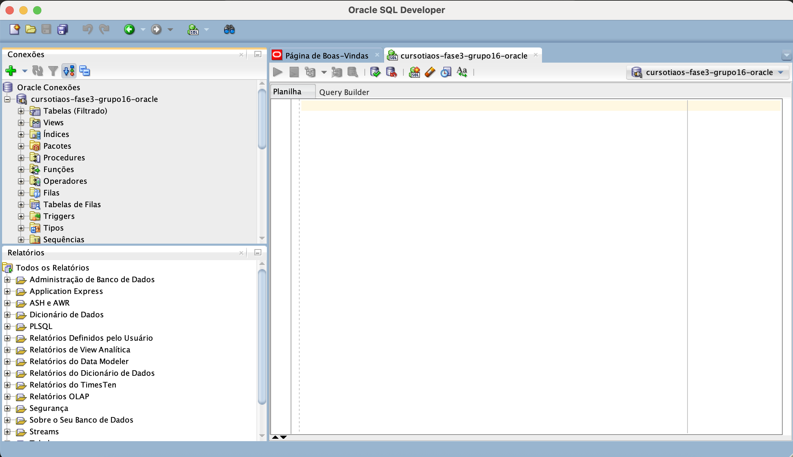

### Etapa 2: Processo de Importação
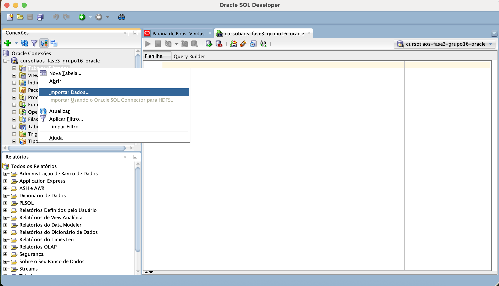

### Etapa 3: Configuração da Importação (1/5)
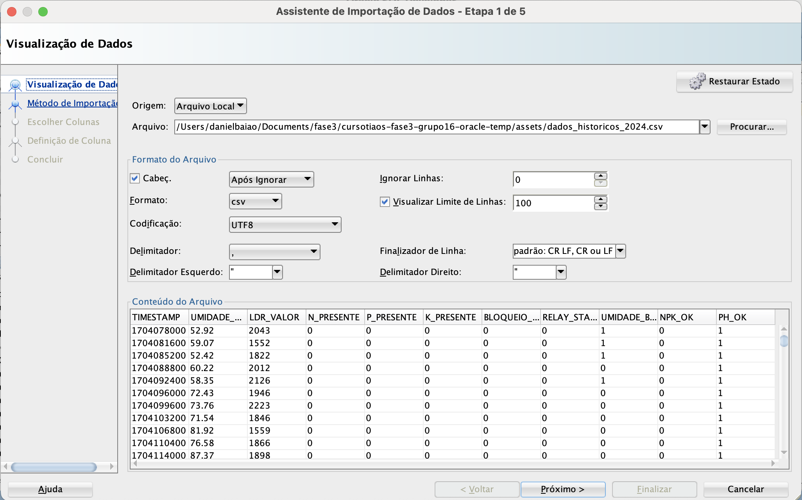

### Etapa 4: Definição da Tabela (2/5)
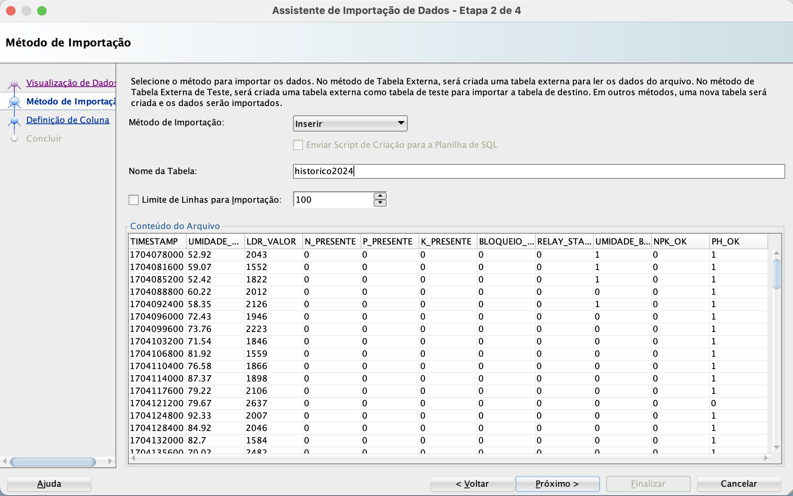

### Etapa 5: Mapeamento de Colunas (3/5)
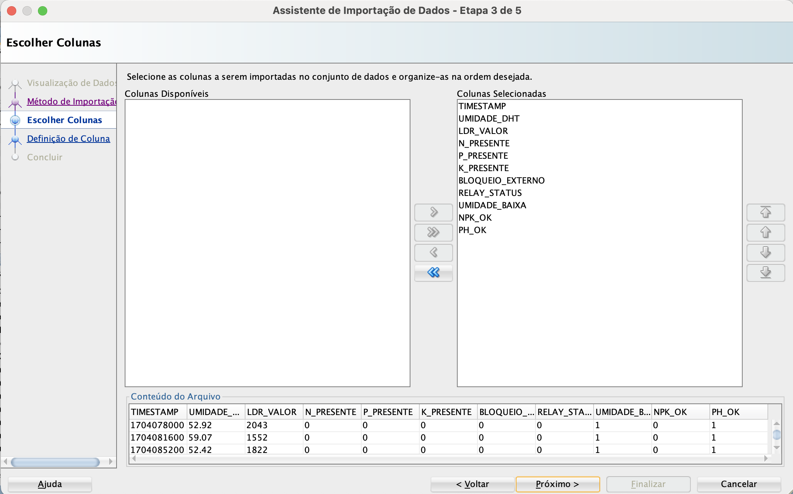

#### TIMESTAMP
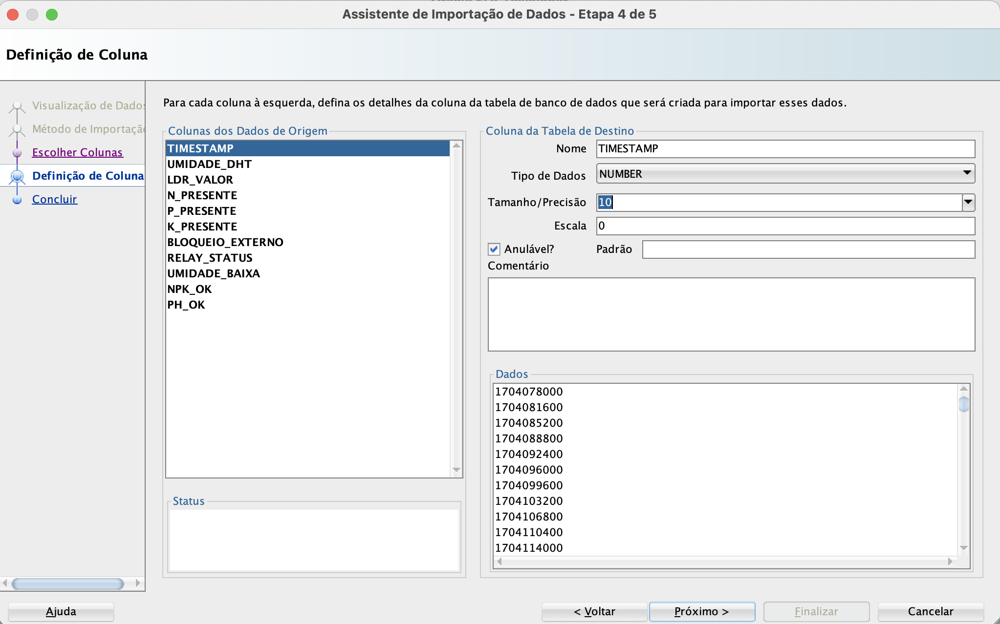

#### UMIDADE_DHT  
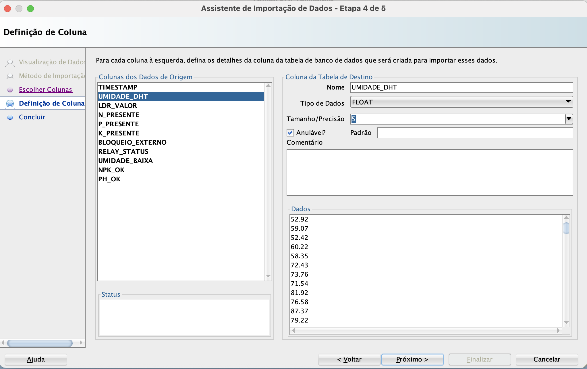

#### LDR_VALOR
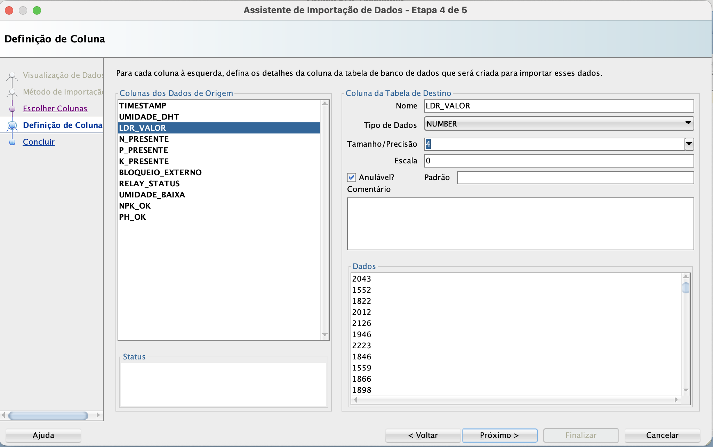

#### Nutrientes N, P, K
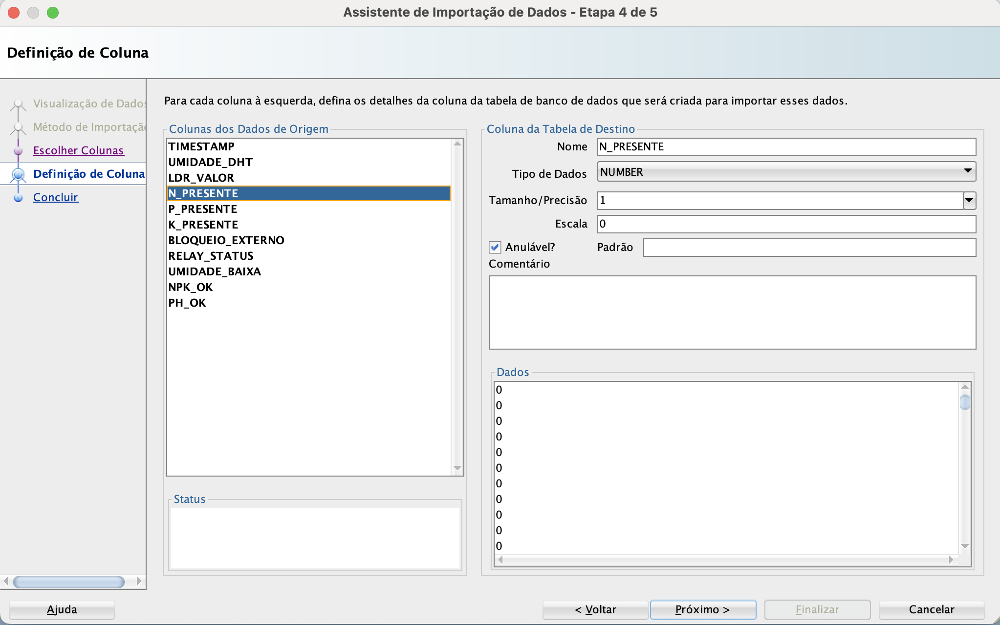

#### Status e Indicadores
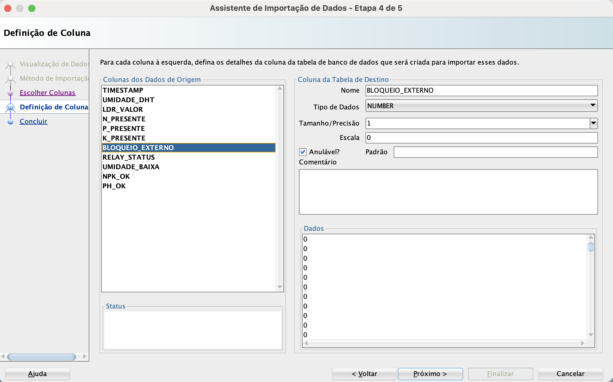
- BLOQUEIO_EXTERNO: NUMBER(1,0)
- RELAY_STATUS: NUMBER(1,0)  
- UMIDADE_BAIXA: NUMBER(1,0)
- NPK_OK: NUMBER(1,0)
- PH_OK: NUMBER(1,0)

### Etapa 6: Revisão Final
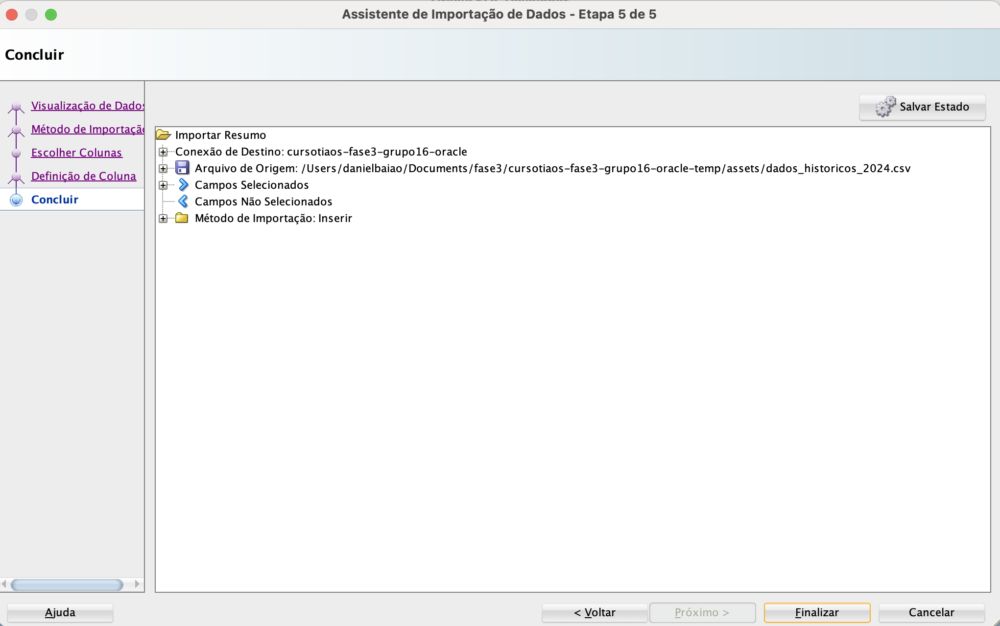

### Etapa 7: Importação Concluída
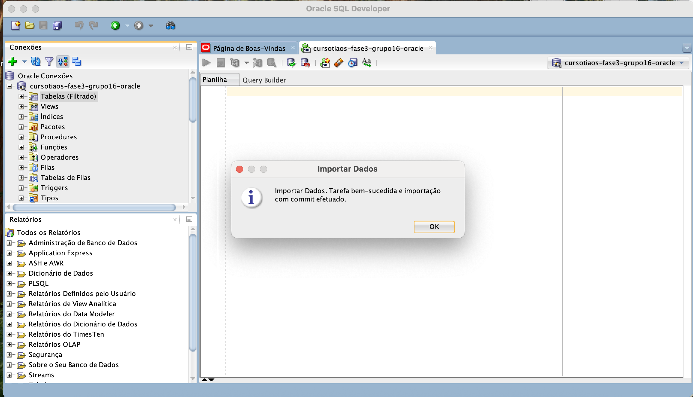

## ✅ Verificação dos Dados

### Visualizar Estrutura da Tabela
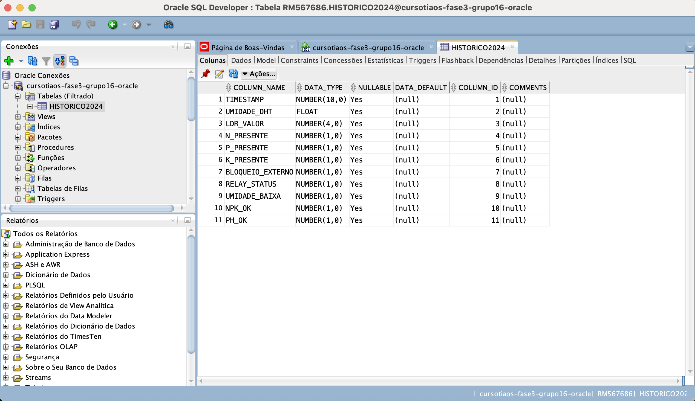

### Consulta Completa dos Dados
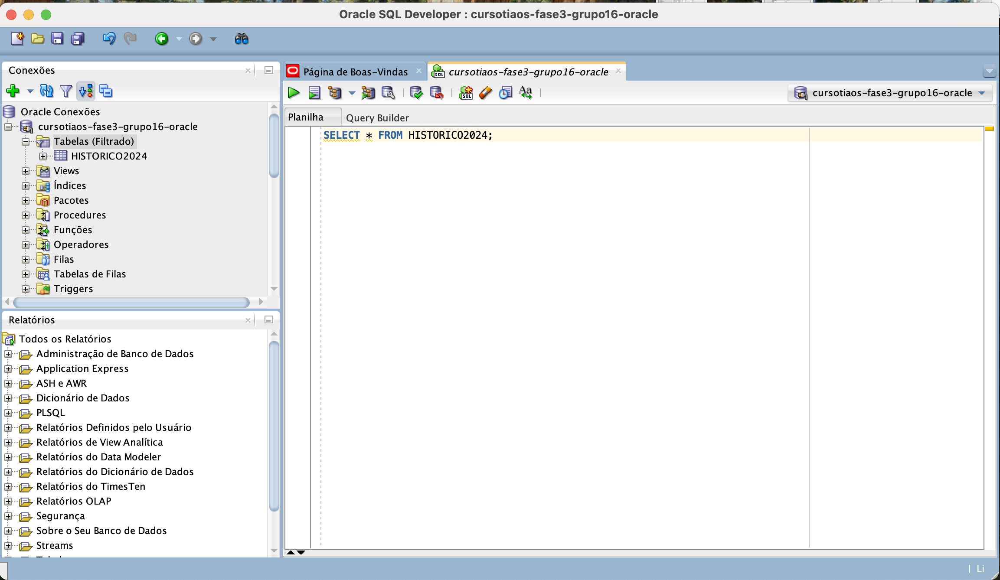

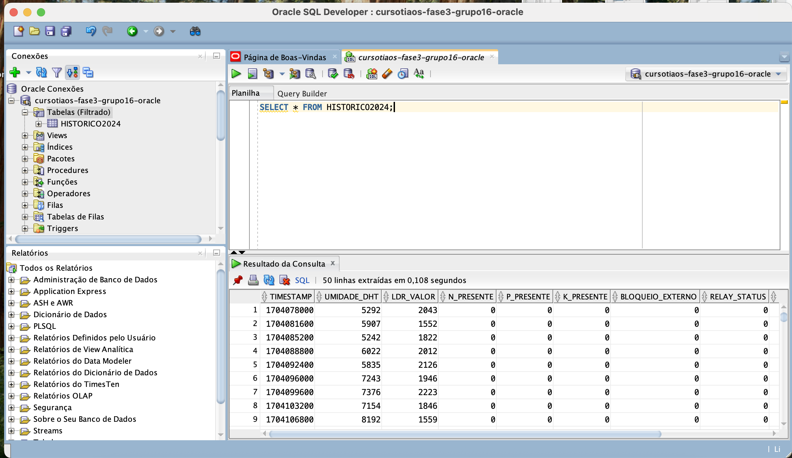